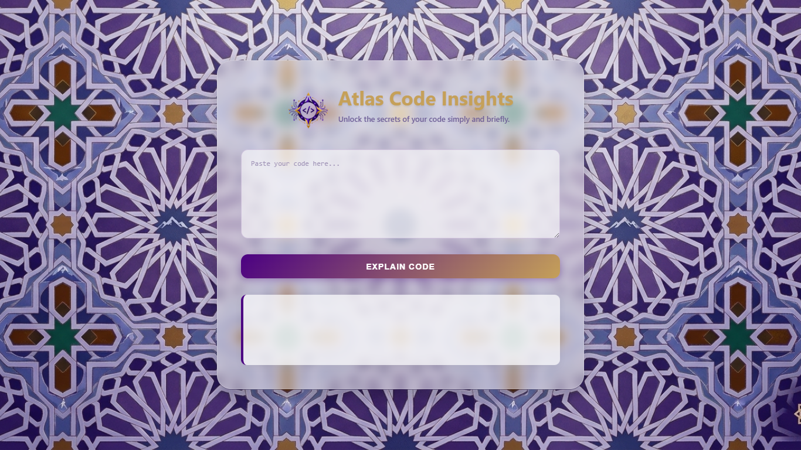
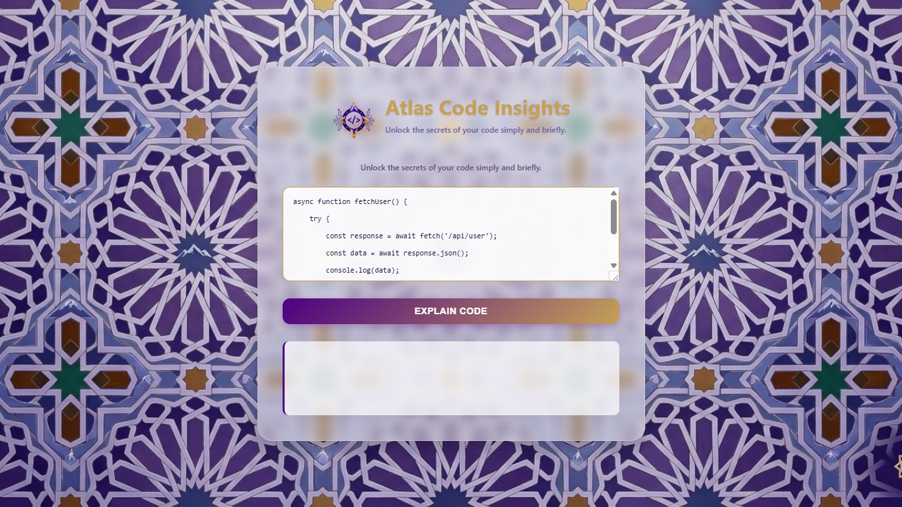
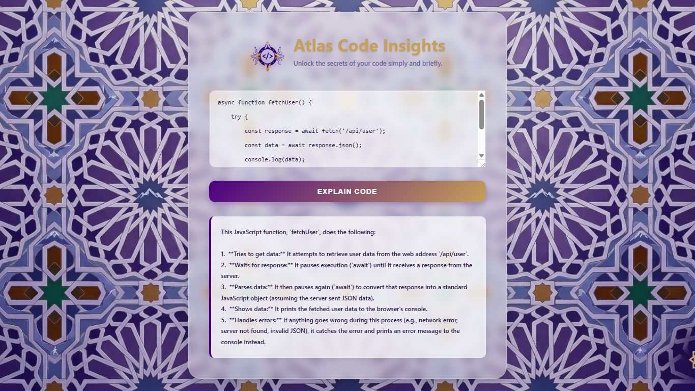

# Atlas Code Insights

AI-powered web application that explains source code using Google Gemini API.

## Features

- Explain code intelligently
- Modern responsive UI
- Gemini AI integration
- Fast code analysis
- Clean developer experience

## Technologies

- HTML
- CSS
- JavaScript
- Node.js
- Express.js
- Google Gemini API

## Installation

```bash
npm install
```

## Run Project

```bash
node server.js
```

## Environment Variables

Create a `.env` file:

```env
GEMINI_API_KEY=your_api_key
```

## Screenshots

### 1. A Calming Environment for Developers


### 2. Paste Any Complex Code Snippet


### 3. Unlock Clear Insights in Seconds


## Author

Abderrahmane Hamid